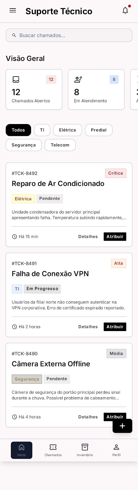

# 🖥️ Dashboard de Suporte Técnico

<p align="center">
  
</p>

<p align="center">
  
  
  
  
  
</p>

> Dashboard moderno e responsivo para gestão de chamados de suporte técnico, com autenticação, relatórios em tempo real e controle de inventário.

---

## 🚀 Funcionalidades

| Módulo | Descrição |
|--------|-----------|
| 🔐 **Autenticação** | Login/Registro com Supabase Auth |
| 📋 **Chamados** | Criação, visualização e atualização de status em tempo real |
| 📊 **Relatórios** | Gráficos de status, categoria e prioridade via Chart.js |
| 📦 **Inventário** | Listagem e controle de ativos técnicos |
| 📱 **Responsivo** | Layout adaptado para desktop e mobile com bottom nav |
| ⚡ **Real-time** | Atualizações instantâneas via Supabase Realtime |

---

## 🛠️ Tecnologias

- **[Vite 5](https://vitejs.dev/)** — Frontend tooling ultrarrápido
- **[Supabase](https://supabase.com/)** — Backend as a Service (Auth, Database & Realtime)
- **[Chart.js](https://www.chartjs.org/)** — Visualização de dados
- **[Vanilla CSS](https://developer.mozilla.org/pt-BR/docs/Web/CSS)** — Design system customizado sem dependências externas
- **[Material Symbols](https://fonts.google.com/icons)** — Ícones

---

## 📦 Instalação e Uso

### Pré-requisitos
- [Node.js](https://nodejs.org/) v18 ou superior
- Conta no [Supabase](https://supabase.com/) com projeto criado

### 1. Clone o repositório
```bash
git clone https://github.com/Adrianovr645/Projeto-APP-Suporte-T-cnico.git
cd Projeto-APP-Suporte-T-cnico
```

### 2. Instale as dependências
```bash
npm install
```

### 3. Configure as variáveis de ambiente
```bash
# Copie o arquivo de exemplo
cp .env.example .env
```

Edite o `.env` com suas credenciais do Supabase:
```env
VITE_SUPABASE_URL=https://SEU-PROJETO.supabase.co
VITE_SUPABASE_ANON_KEY=sua-chave-anonima-aqui
```

### 4. Configure o banco de dados
Execute as migrations em `supabase/migrations/` no SQL Editor do seu projeto Supabase.

### 5. Inicie o servidor de desenvolvimento
```bash
npm run dev
```

Acesse: `http://localhost:5173`

---

## 📁 Estrutura do Projeto

```
📦 Projeto-APP-Suporte-Tecnico
 ├── 📄 index.html          # Página principal do dashboard
 ├── 📄 code.html           # Página auxiliar
 ├── 📁 src/
 │   ├── 📄 main.js         # Lógica principal da aplicação
 │   ├── 📁 lib/
 │   │   └── 📄 supabase.js # Cliente Supabase
 │   └── 📁 styles/         # Design system CSS
 ├── 📁 supabase/
 │   ├── 📄 config.toml     # Configuração do projeto Supabase
 │   └── 📁 migrations/     # Scripts SQL do banco de dados
 ├── 📄 .env.example        # Template de variáveis de ambiente
 ├── 📄 package.json
 └── 📄 vite.config.js
```

---

## 🔒 Segurança

- ✅ Credenciais gerenciadas via **variáveis de ambiente** (`.env`) — nunca comitadas
- ✅ Acesso ao banco protegido por **Row Level Security (RLS)** no Supabase
- ✅ Autenticação gerenciada pelo **Supabase Auth**
- ✅ `.env` listado no `.gitignore`

> ⚠️ **Importante:** Nunca compartilhe ou comite seu arquivo `.env`. Use sempre `.env.example` como referência.

---

## 📜 Scripts disponíveis

| Comando | Descrição |
|---------|-----------|
| `npm run dev` | Inicia o servidor de desenvolvimento |
| `npm run build` | Gera o bundle de produção em `/dist` |
| `npm run preview` | Pré-visualiza o build de produção |

---

## 🤝 Contribuição

1. Fork o projeto
2. Crie sua branch: `git checkout -b feature/minha-feature`
3. Commit suas alterações: `git commit -m 'feat: adiciona minha feature'`
4. Push para a branch: `git push origin feature/minha-feature`
5. Abra um Pull Request

---

## 📄 Licença

Distribuído sob a licença MIT. Veja `LICENSE` para mais informações.

---

<p align="center">Desenvolvido por <a href="https://github.com/Adrianovr645">Adriano</a> 🚀</p>
